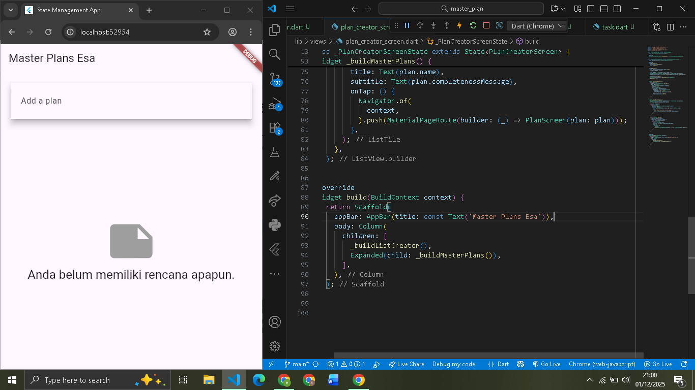

# master_plan

A new Flutter project.

## Getting Started

# Tugas Praktikum 1
2. Jelaskan maksud dari langkah 4 pada praktikum tersebut! Mengapa dilakukan demikian?
- Pada langkah 4 dibuat file data_layer.dart sebagai barrel file, yaitu file yang mengumpulkan dan mengekspor semua model seperti plan.dart dan task.dart. Tujuannya agar proses import di file lain menjadi lebih sederhana dan terstruktur, sehingga pengelolaan kode lebih rapi dan konsisten.

3. Mengapa perlu variabel plan di langkah 6 pada praktikum tersebut? Mengapa dibuat konstanta?
Variabel plan digunakan untuk menyimpan struktur data utama aplikasi, yaitu daftar rencana dan tugas. Variabel ini dibuat const untuk memberikan nilai awal yang bersifat tetap dan aman. Nilai awalnya tidak berubah, tetapi isi state-nya nanti tetap dapat dimodifikasi melalui mekanisme yang sesuai, seperti setState(). Dengan const, inisialisasi awal lebih efisien dan terkontrol.

5. Apa kegunaan method pada Langkah 11 dan 13 dalam lifecycle state?
- initState()
Dipanggil sekali ketika state dibuat. Digunakan untuk menginisialisasi komponen yang membutuhkan setup awal, seperti ScrollController.
- dispose()
Dipanggil saat widget tidak lagi digunakan. Fungsinya membersihkan resource seperti controller atau listener agar tidak terjadi memory leak.

# Tugas Praktikum 2
2. Jelaskan mana yang dimaksud InheritedWidget pada langkah 1 tersebut! Mengapa yang digunakan InheritedNotifier?
- InheritedWidget yang dimaksud adalah PlanProvider, yaitu widget yang menurunkan data Plan ke seluruh widget anak tanpa perlu mengirimnya melalui konstruktor. Pada praktikum digunakan InheritedNotifier karena state aplikasi disimpan dalam ValueNotifier. Dengan InheritedNotifier, setiap perubahan nilai pada ValueNotifier akan otomatis memberi tahu widget turunannya untuk rebuild. Pendekatan ini lebih efisien dibanding InheritedWidget biasa yang membutuhkan penanganan perubahan state secara manual.

3. Jelaskan maksud dari method di langkah 3 pada praktikum tersebut! Mengapa dilakukan demikian?
- Method pada langkah 3 digunakan untuk menghitung jumlah tugas yang sudah diselesaikan dan menghasilkan teks progres, seperti “2 dari 5 tugas”. Cara ini membuat tampilan status kemajuan suatu Plan selalu diperbarui secara dinamis sesuai kondisi data, sehingga informasi progres lebih akurat dan mudah dipahami pengguna.

# Tugas Praktikum 3

Gambar kiri menunjukkan struktur widget saat aplikasi masih berada pada halaman PlanCreatorScreen. Pada tahap ini, MaterialApp menjadi root, PlanProvider menyediakan data plan secara global, dan PlanCreatorScreen menampilkan input untuk membuat plan baru serta ListView untuk menampilkan daftar plan yang sudah ada.

Gambar kanan memperlihatkan struktur setelah pengguna memilih salah satu plan dan aplikasi berpindah ke halaman PlanScreen melalui Navigator.push. Di halaman ini, PlanScreen menampilkan detail plan yang dipilih, seperti daftar tugas melalui ListView, serta teks informasi progres. Penambahan Scaffold dan SafeArea membuat tata letak lebih rapi dan sesuai struktur halaman baru.