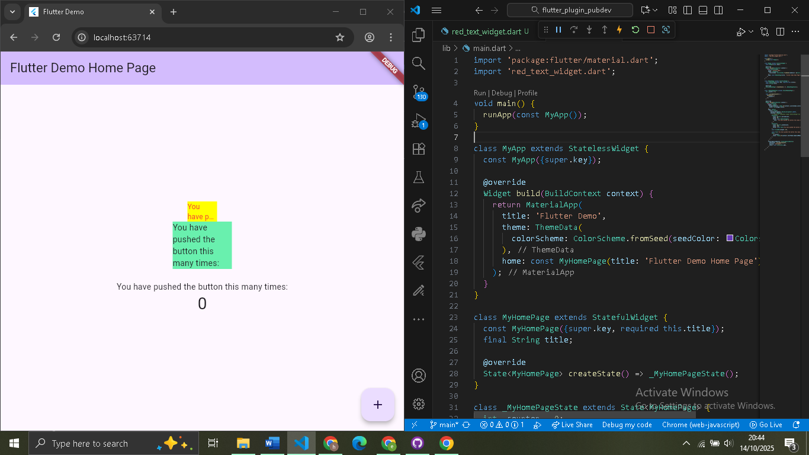

# flutter_plugin_pubdev

A new Flutter project.

## Getting Started

2. Jelaskan maksud dari langkah 2 pada praktikum tersebut!

jawab: Langkah ini dilakukan untuk menambahkan library eksternal bernama auto_size_text ke dalam project Flutter. Library ini berfungsi agar ukuran teks bisa otomatis menyesuaikan dengan ruang tampilan, sehingga jika teks terlalu panjang, ukurannya akan diperkecil supaya tetap muat dan tampil rapi tanpa terpotong.

3. Jelaskan maksud dari langkah 5 pada praktikum tersebut!

jawab: Langkah 5 dilakukan untuk menambahkan variabel text serta parameter pada constructor supaya widget RedTextWidget dapat menerima input teks dari luar. Dengan begitu, setiap kali widget ini digunakan, kita bisa mengirimkan teks yang berbeda melalui parameter text, sehingga widget menjadi lebih dinamis dan dapat menampilkan berbagai teks sesuai kebutuhan.

4. Pada langkah 6 terdapat dua widget yang ditambahkan, jelaskan fungsi dan perbedaannya!

jawab:

- RedTextWidget memakai plugin auto_size_text, sehingga ukuran tulisannya dapat menyesuaikan secara otomatis agar tetap muat dalam wadahnya, serta teksnya ditampilkan dengan warna merah.

- Sedangkan Text merupakan widget bawaan Flutter yang tidak memiliki kemampuan menyesuaikan ukuran teks secara otomatis, sehingga jika teks terlalu panjang, bisa saja terpotong atau meluap keluar dari area tampilannya.

5. Jelaskan maksud dari tiap parameter yang ada di dalam plugin auto_size_text berdasarkan tautan pada dokumentasi ini !

jawab:

text → isi teks yang ingin ditampilkan.

style → mengatur gaya teks (warna, ukuran, tebal, font, dll).

minFontSize → ukuran font terkecil agar teks tetap muat.

maxFontSize → ukuran font terbesar yang boleh digunakan.

stepGranularity → jarak perubahan ukuran font saat menyesuaikan ukuran.

presetFontSizes → daftar ukuran font tertentu yang bisa dipilih otomatis.

group → menyamakan ukuran font beberapa teks agar seragam.

textAlign → posisi teks (kiri, kanan, tengah, rata).

maxLines → jumlah baris maksimal teks.

overflow → aturan jika teks terlalu panjang (misal jadi “…”).

overflowReplacement → widget pengganti jika teks tetap tidak muat.

softWrap → menentukan apakah teks boleh pindah baris otomatis.

wrapWords → menentukan apakah kata panjang boleh dipotong.

textScaleFactor → faktor skala teks (biasanya dari pengaturan sistem).

semanticsLabel → teks alternatif untuk pembaca layar (aksesibilitas).